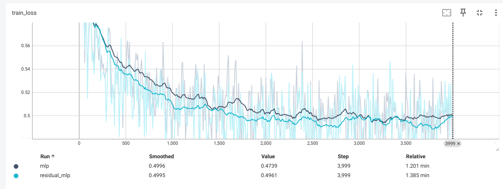
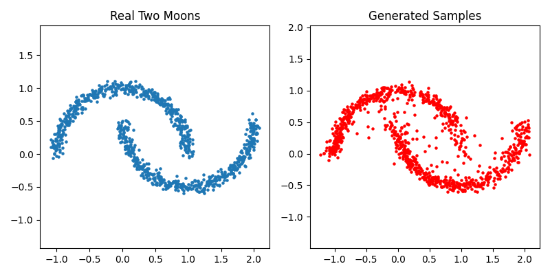
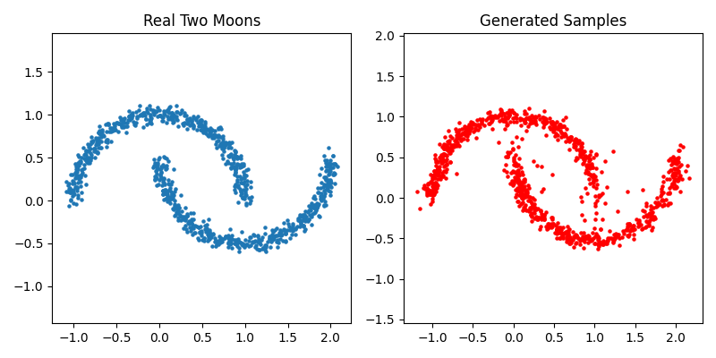

# Diffusion Model for Two Moons Distribution

This project implements a simple 2D diffusion model using PyTorch Lightning to learn and generate samples from the Two Moons distribution.

## Project Goals

- Train a diffusion model to gradually sample from a 2D Gaussian distribution to approximate the Two Moons distribution.
- Visualize and compare real and generated samples.

## Project Structure

```text
├── models/                 # Network definitions (MLP, residual MLP)
├── ddmp_module.py          # Main training script
├── requirements.txt        # Dependency list
├── README.md               # Project description (this file)

```

## Environment Requirements

- Python 3.8+
- PyTorch 1.13+
- PyTorch Lightning 2.0+
- scikit-learn
- matplotlib


Install dependencies with:

```bash
pip install -r requirements.txt

python ddmp_module.py

``` 


# Summary of Diffusion Model Project
## Project Overview
This project implements a diffusion model to generate samples approximating the Two Moons distribution using PyTorch Lightning.

## Methodology
- Model: MLP-based noise predictor taking 2D points and timestep embeddings.
- Noise schedule: Linear beta schedule with 100 timesteps.
- Training: 2000 epochs using Adam optimizer.
- Sampling: Euler method for reverse diffusion.

## Evaluation Metrics
We used the Maximum Mean Discrepancy (MMD) to quantify the similarity between generated and real samples. MMD measures the difference in distributions with lower values indicating better fit.

## Results
- Training loss converged steadily (plot attached).
- using basic residual MLP network and scheduler_type linear: MMD between real and generated samples: 0.003412
- using basic residual MLP network and scheduler_type cosine: MMD between real and generated samples: 0.001054
- using basic MLP network and scheduler_type linear: MMD between real and generated samples: 0.007543
- using basic MLP network and scheduler_type cosine: MMD between real and generated samples: 0.03199
- from the train loss diagram it can be seen with more complex network like residual MLP to basic MLP it showed a better performance and faster to converge, with cosine schedule type has better performance and faster to converge.

- The generated samples visually resemble the real Two Moons data.
- MLP network


- Residual MLP network



